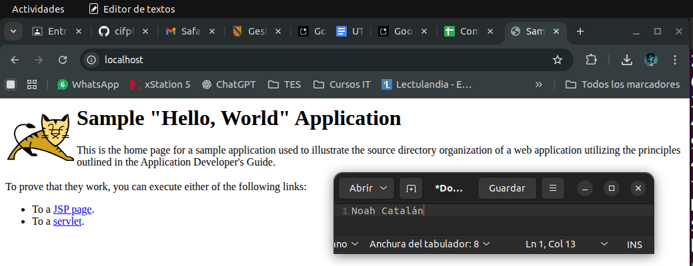
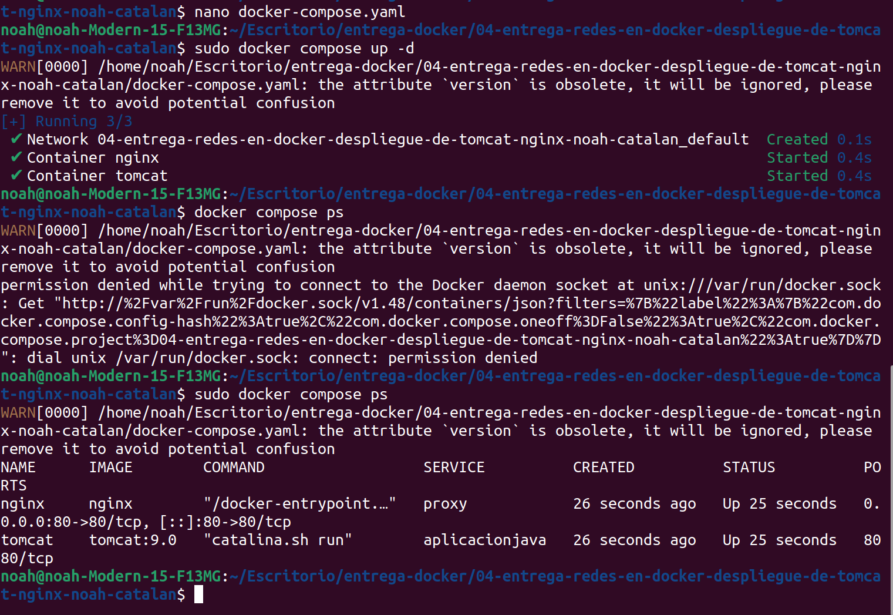

# Entrega: Redes en Docker

**Nombre:** Noah Catalán Rosell

---

## Parte A: Despliegue con Docker CLI

Se crea una red bridge y se despliegan manualmente los contenedores de Tomcat y Nginx, conectándolos a dicha red. El resultado se comprueba accediendo a la aplicación a través del proxy inverso.

## Parte B: Despliegue con Docker Compose

Se utiliza un fichero `docker-compose.yaml` para definir y orquestar el despliegue de ambos servicios de forma automatizada. El comando `docker compose ps` confirma que ambos contenedores están funcionando correctamente.

